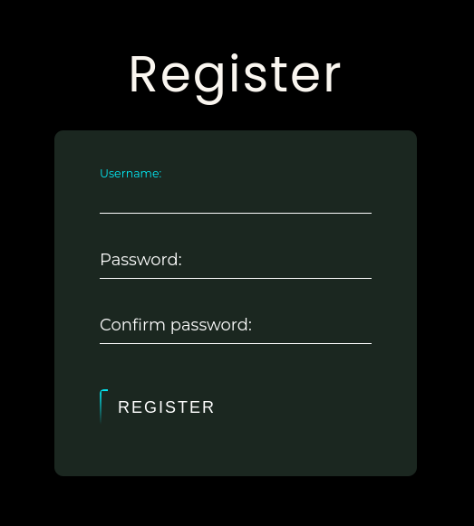
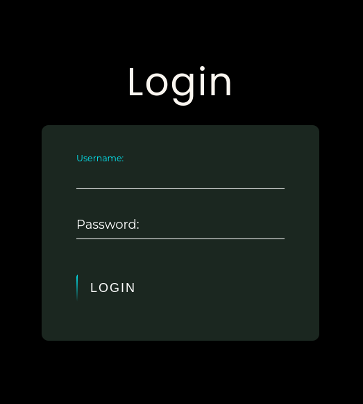
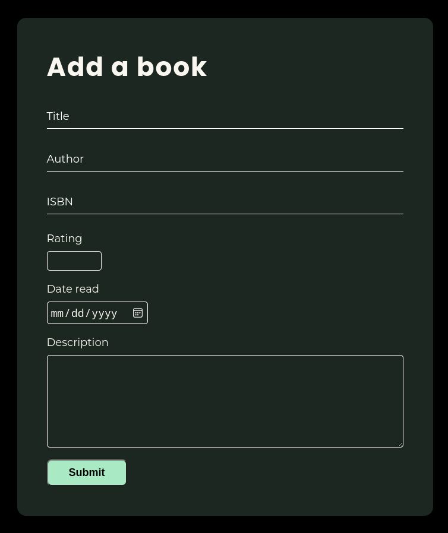

# Reed's Booknotes

A web app for note taking of all the important points to remember in all of the books I read.

### *Technologies I used*
- ExpressJs - for backend server  
- PostgreSQL - database  
- passport - for authentication  
- bcrypt - for password protection  

## *Features*
1. Registering and logging in as an admin
    - In order to save books and add notes, you need to log in as an admin for the site. The web app handles the registration and lon in for the admin user.

    
    

2. Saving books read
    - After loggin in as an admin user, you can save add and save books you read in the database.

    
    
    
3. Saving notes
    - By being an admin user, you can add and save notes for each book in the database.

    
    

### *How to use*
In the CLI of your folder location, enter:
```bash
npm i

# then

npm start
```